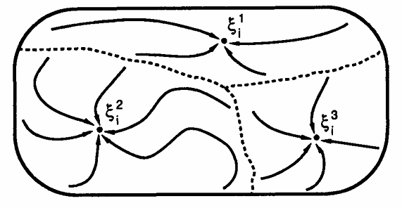
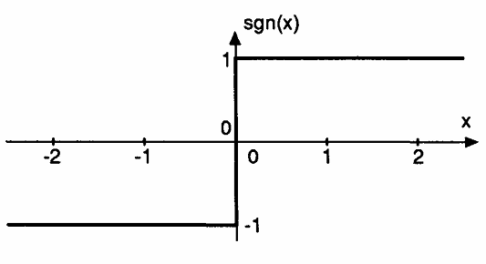
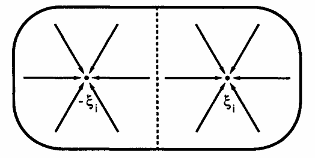
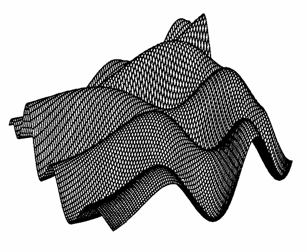

# Hopfield

## Problema de Memoria Asociativa

Guardar un conjunto de $p$ patrones $\xi^{\mu}_{i}$ de forma que presentado un nuevo patrón $\zeta_{i}$, la red responda produciendo el patrón que mejor de asemeja a $\zeta_{i}$.

## Espacio de Configuración

Los $\xi^{\mu}_{i}$ son los patrones guardados previamente en la red. Los estados que resuelven a uno de estos son inestables y los que están encima de las lineas son estados espureos.

`Estado espureo`: Es un estado estable, la red logró converger hacia algún patrón, pero este no fué enseñado en la etapa de entrenamiento.

## Modelo de Hopfield

Los valores de activación de este modelo son $+1$ (activo) y -1 (inactivo) en vez de $1$ y $0$, se llaman $S_{i}$ en vez de $n_{i}$. Se puede pasar entre notaciones teniendo en cuenta que $S_{i} = 2n_{i} - 1$. Ahora esta ecuación modela a cada neurona en la red:

$$S_{i} \coloneqq sgn\left(\sum_{j} w_{ij} S_{j} - \theta_{i}\right)$$

donde utiliza la función signo $sgn(x)$ como función de activación.

$$
sgn(x) =
\begin{cases}
   1 & \text{if } x \geq 0, \\
  -1 & \text{if } x < 0,
\end{cases}
$$

acá decide el libro dejar el término de $\theta_{i}$, por lo que finalmente termina siendo así:

$$S_{i} \coloneqq sgn\left(\sum_{j} w_{ij} S_{j}\right)$$

## Tipos de entrenamiento

1. `Sincrónico`: Se actualizan todos los pesos simultaneamente en cada paso de tiempo.
1. `Asincrónico`: Se elige una permutación de las neuronas, por cada una aplicamos la regla anterior.

¿Cuantas veces corremos el algoritmo? El libro dice que podríamos correrlo hasta que la red llegue al punto de que el patrón que se quiere aprender sea un estado estable, cosa que tiene sentido, es la definición de estado estable.

## Ejemplo de un único patrón

Para considerar a un patrón como estable basta con que:

$$
sgn\left(\sum_{j} w_{ij} \xi_{j}\right) = \xi_{i} \qquad \forall i
$$

Los pesos se definen de la siguiente manera, se entrena la red con:

$$w_{ij} = \frac{1}{N} \xi_{i} \xi_{j}$$

$\xi_{i}$ es un estado estable de la red $\iff$ $-\xi_{i}$ también lo es. Teniendo una red entrenada con un único patron, todas las configuraciones iniciales que tengan más de la mitad de los bits distintos a la original, van a terminar en el estado inverso.

Podríamos imaginar que el espacio de configuraciones está partido en 2, aquellas configuraciones que estén más cerca del estado inverso van a caer hacia allá.

## Ejemplo de patrones múltiples

Ahora definimos los pesos de la siguiente manera (Regla de Hebb):

$$w_{ij} = \frac{1}{N} \sum^{p}_{\mu=1} \xi^{\mu}_{i} \xi^{\mu}_{j}$$

Donde $p$ es la cantidad de patrones a aprender, $i$ y $j$ son el subíndice del patrón donde $\xi^{\mu}_{i}$ representa el i-ésimo valor del mu-ésimo patrón.

Para considerar un patrón como estable ahora tenemos que:

$$sgn(h^{\nu}_{i}) = \xi^{\nu}_{i}, \qquad \forall i$$

donde

$$
h^{\nu}_{i} \equiv \sum_{j} w_{ij} \xi^{\nu}_{j} = \frac{1}{N} \sum_{j} \sum_{\mu} \xi^{\mu}_{i} \xi^{\mu}_{j} \xi^{\nu}_{j}
$$

donde podemos tomar de la última igualdad que:

$$
h^{\nu}_{i} = \xi^{\nu}_{i} + \frac{1}{N} \sum_{j} \sum_{\mu \ne \nu} \xi^{\mu}_{i} \xi^{\mu}_{j} \xi^{\nu}_{j}
$$

El segundo término se llama `crosstalk term` o `término de diafonía` que si es chico para todo $i$ y todo $\nu$, entonces la red aprendió los patrones, osea, los patrones almacenados son estables.

## Capacidad de almacenamiento

La capacidad de almacenamiento es 

Podemos calcular la capacidad de almacenamiento de la red de la siguiente manera:

$$C^{\nu}_{i} \equiv -\xi^{\nu}_{i} \frac{1}{N} \sum_{j} \sum_{\mu \ne \nu} \xi^{\mu}_{i} \xi^{\mu}_{j} \xi^{\nu}_{j}$$

que es lo mísmo que $-\xi^{\nu}_{i}$ multiplicado por el `crosstalk term`. Si $C^{\nu}_{i}$ es negativo, el `crosstalk term` tiene el mismo signo que $\xi^{\nu}_{i}$ y entonces está bien. Pero si $C^{\nu}_{i}$ es positivo y mayor a $1$, cambia el signo de $h^{\nu}_{i}$ y hace el bit (o neurona) $i$ del patrón $\nu$ inestable; si empezaramos el sistema en el patrón deseable $\xi^{nu}_{i}$, **no** se quedaría ahí.

## Función de Energía

La función de energía se define como:

$$
H = -\frac{1}{2} \sum_{i} \sum{j} w_{ij} S_{i} S_{j}
$$

Una propiedad importante de esta funcíon es que es siempre **decreciente** (o se mantiene constante, pero nunca crece) a medida que el sistema evoluciona. Los atractores (patrones memorizados) son un mínimo local de la superficie de energía. Podemos imaginar una partícula en la superficie que gracias a la gravedad la tira para abajo, en la que dado un estado inicial cae hacia alguno de los mínimos locales hasta frenar y alcanzar alguno de los estados estables.

## Estados Espureos

Como estableció el libro antes, si tenemos aprendido el patrón $\xi$ entonces $-\xi$ es un estado estable y tienen la misma energía. Por ende estos son mínimos locales en la función de energía de Hopfield. Pero no son los únicos, también existen combinaciones de los patrones aprendidos tales que son **mezclas** de otros atractores pero distintos a todos ellos. Son combinaciones lineales de una cantidad impar de ellos, por ejemplo:

$$
\xi^{mix}_{i} = sgn\left(\pm \xi^{\mu_{1}}_{i} \pm \xi^{\mu_{2}}_{i} \pm \xi^{\mu_{3}}_{i}\right)
$$

Cualquier combinación de signos van a dar un atractor mezcla.

También existen estados llamados **spin glass** a medida que $p$ (la cantidad de patrones) crece empiezan a aparecer, estos no están correlacionados a las imágenes.

Estos estados suelen tener poca fuerza de atracción en comparación a los patrones aprendidos, pero al ser siempre decreciente la función de energía, entonces si se entra en un valle, no se va a salir.
