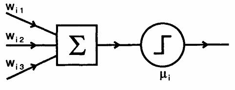

# Introducción

## Modelo matemático de una neurona, propuesto por McCulloch y Pitts.

$$n_{i}(t + 1) = \Theta\left(\sum_{j} w_{ij} n_{j} - \mu_{i}\right)$$

$w_{ij}$ representa la fuerza de la conexión de sinapsis entre las neuronas i y j.

## Función de Heaviside

$$
\Theta(x) =
\begin{cases}
  1 & \text{if } x \geq 0, \\
  0 & \text{otherwise.}
\end{cases}
$$

## Neurona más generica

$$n_{i} := \operatorname{g}\left(\sum_{j} w_{ij} n_{j} - \mu_{i}\right)$$

$\operatorname{g}$ es la función de activación (activation function, gain function, transfer function or squashing function). Como el entrenamiento es asincrónico, se pierde la noción de tiempo, ahora las neuronas se entrenan de forma aleatoria.
